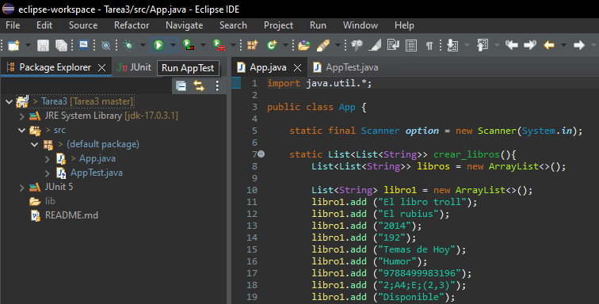
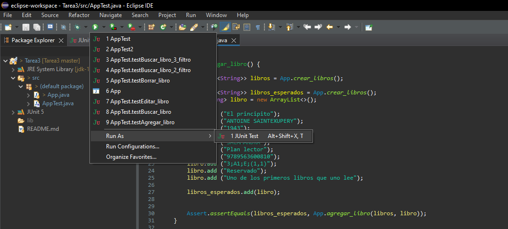
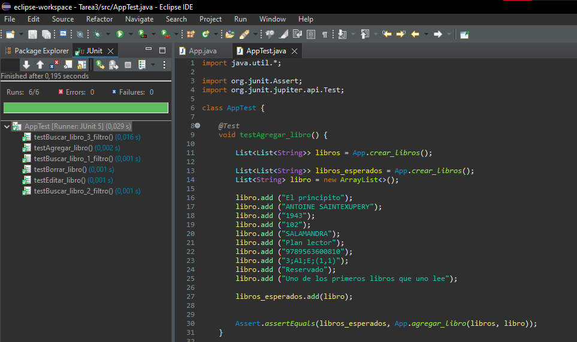
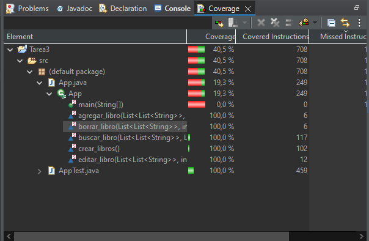

## Como ejecutar el programa

Para la ejecución del programa se necesita la herramientes "Eclipse".

Abrir el proyecto con Eclipse y luego posicionarse en el archivo "App.java" ubicado en Tarea3/src/(default package), y luego correr con el boton run de Eclipse

## Como ejecutar suite de pruebas

Posicionarse en el archivo "AppTest.java" ubicado en Tarea3/src/(default package), luego desplegar las opciones del boton run, ir a "Run As" y finalmente seleccionar "JUnit Test"

A continuación se muestra una imagen del resultado de las pruebas ejecutadas:

## Cobertura de las pruebas

A continuación se muestra la cobertura de las pruebas realizadas:

